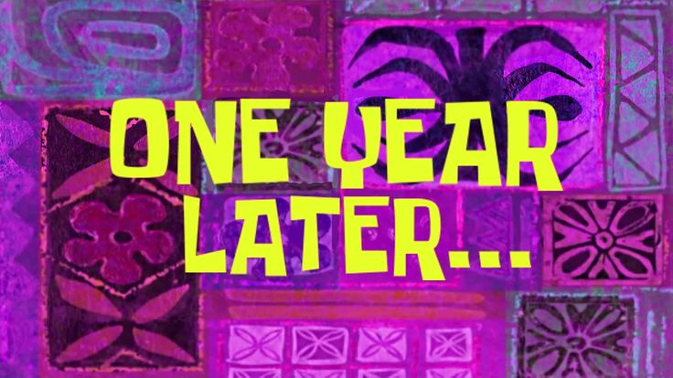

The Redwood framework has always held a special place in my heart. My first open-source contribution was a one-line CSS fix to its starter page. The community was welcoming, encouraging, and filled with smart, capable developers.

I found RedwoodJS early on when I was learning web development. Its docs and tutorials introduced me to React, GraphQL, Tailwind, Storybook, and component testing, with an actual app to run and give it all something to do. It also introduced me to [Railway](https://railway.app), which is still one of my favorite places to host anything that needs a long-running server. Not affiliated, just a fan.

When RedwoodJS reinvented itself as [RedwoodSDK](https://rwsdk.com), I was sold immediately. How many frameworks get to just wipe the slate clean and rebuild everything having learned from their mistakes? React on Cloudflare, with Durable Objects in the mix, got me thinking about realtime multiplayer apps. My mind immediately went to a Jeopardy-style game, like something you might see on Dropout. More specifically, the part where everyone insists they buzzed in first.

Obviously, before writing any code, I needed a domain.

My first several choices were taken, but eventually I landed on [**bzzr.app**](https://bzzr.app), which I liked better anyway. I `git init`-ed and `npx create`-ed my way to a new  RedwoodSDK app, and got CI hooked up to deploy my Hello World to my shiny new domain.

Who among us doesn't have a plethora of half-thought-out abandoned side projects? Well with RedwoodSDK at 1.0, now seemed as good a time as any to follow through and give that domain something to do.

The idea was still small: a web buzzer for trivia nights. The host creates a room, friends join with a code, a link, or a QR code, and everyone gets a button to mash. No account, no download, no setup that takes longer than explaining the game. I hadn't found something that worked the way I thought it should, so I built it.

Keeping that scope was part of the appeal. You bring the questions and keep score however you like. bzzr handles who buzzed in and in what order. The host controls rounds and can play along, too.

The interesting technical decision was also the one that drew me to the project: **one Durable Object per room**. Everyone in a room connects to the same object over a WebSocket. It owns the room's state, accepts buzzes, and sends the resulting order back to everyone. RedwoodSDK brings React and the Cloudflare Worker together, keeping me focused on the domain, just the way I like.

So it works out that the architecture of the app maps neatly to the domain of the game itself. Each group needs one place to settle what happened, and separate games don't need to know about each other. I don't have to build a shared room registry or coordinate room state across server instances. Cloudflare gives me that boundary as a DO, and I can concentrate on what happens inside it.

One caveat: buzz order is the order the server receives the buzzes. A player's browser doesn't get to claim first place based on its own clock. That gives everyone a consistent result, even if it can't make everyone's network connection equally fast. For a casual trivia night, that's a compromise I'm comfortable with.

Rooms are temporary. They expire after inactivity or a fixed maximum lifetime, and their stored data is deleted. No historical records, no data storage fees.

On the UI side, I'm thoroughly Tailwind-brained. Part of the attraction was being able to start with components from Tailwind Plus and adapt them. I'm no designer, but Steve Schoger sure is, and I'm happy to have a head start.

Storybook was another deliberate choice, and again inspired by those original Redwood tutorials. I was building with AI assistance, and I wanted somewhere to work through the look and feel I had in mind. The same components used in the app can run through simulated rounds in Storybook, so I can iterate on the interface without assembling a room full of players every time. Since the idea is everyone has their own buzzer, mobile layout and experience was a priority - being able to see multiple versions of the same screen without fiddling around in dev tools sped up the process dramatically. You can [poke around in the Storybook](https://storybook.bzzr.app) yourself.

There are a few conveniences thrown around the core of the game too: room for up to 60 players, host controls to remove disruptive players, and a spectator view that you could put on a separate screen or projector. There's even a left-handed mode. You're welcome.

Mostly, though, I wanted something you could pull up when someone says, "We need buzzers" and be playing a minute later.

The [source code is available on GitHub](https://github.com/memarino92/bzzr) under the MIT license. Clone it, modify it, make the design yours. Add chat and questions and build your own trivia SaaS app. Take it wherever you want! My first contribution to Redwood was one line of CSS; it'd be pretty cool if this became someone else's starting point.

[Give bzzr a try](https://bzzr.app). Trivia not included.
